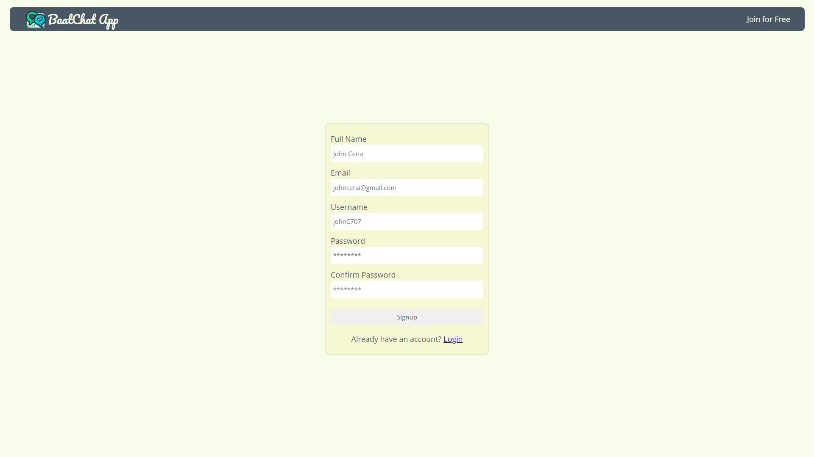
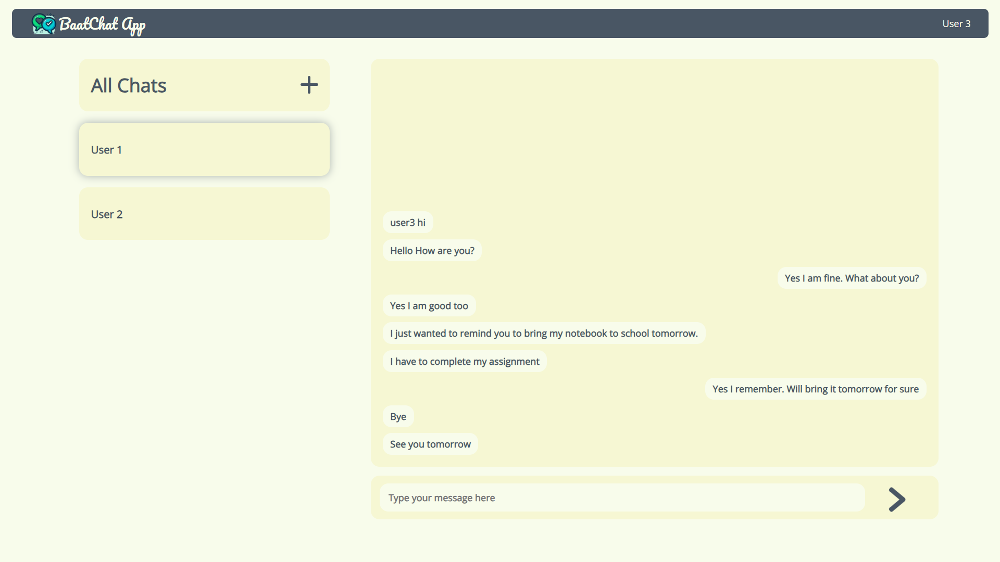
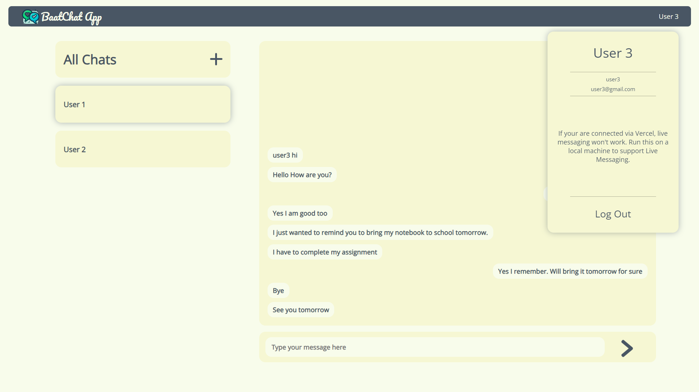
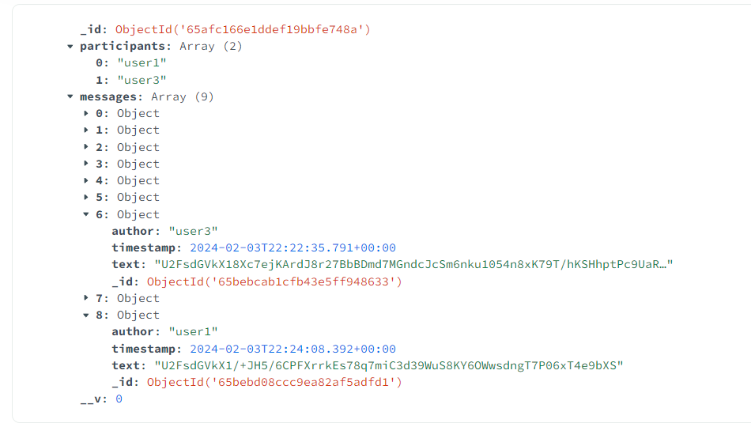

# UI of the app
### Signup Page

### Chatting Page

### Message Storage in the database
The message is encrypted as soon as it leaves the client's device and thus server gets the encrypted message which is stored to the database as shown below.

The message is decrypted when it reaches the client's friend device.

## How the encryption-decryption work
Two friends chatting must have the same key such that a message sent (after encryption) by one user can be read by the other. But we cannot send the decryption key over the network or to the server for security reasons. Therefore, to create a common key that will be used by each of the friends, **Diffie-Hellman Key Exchange** algorithm is used. Once the commmon key is generated, it will be used for both encryption and decryption using a symmetric key encryption, **AES-algorithm**.
### How a common key is generated via Diffie-Hellman Key Exchange
Suppose userA and userB are chatting to each other. userA has a secret key $secA = 13$ and userB has a secret key $secB = 20$. And assume $g = 2$ and $p = 83$ are a generator and a prime number respectively (g and p need not be private or secret).
1. Before the start of chatting, userA sends $g^{secA}(mod\ p) = 2^{13}(mod\ 83) = 58$ and receives $g^{secB}(mod\ p) = 2^{20}(mod\ 83) = 37$ from userB.
2. userA applies a power of $secA (mod\ p)$ to the received key and gets the common key as: $37^{13}(mod\ 83) = 33$
3. userB applies a power of $secB (mod\ p)$ to the key received from A and gets the common key as: $58^{20}(mod\ 83) = 33$
4. Thus, each one of them has generated a common key $33$ **without actually sending** their secret keys.

In this app, secret key of a user is the same as his hashed password. Now the common key 33 will be used for encrypting and decrypting all the chats between the two users using a symmetric encryption algorithm.
\
\
\
\
\
\
\
\
\
\
\
\
\
\
\.
# Getting Started with Create React App

This project was bootstrapped with [Create React App](https://github.com/facebook/create-react-app).

## Available Scripts

In the project directory, you can run:

### `npm start`

Runs the app in the development mode.\
Open [http://localhost:3000](http://localhost:3000) to view it in your browser.

The page will reload when you make changes.\
You may also see any lint errors in the console.

### `npm test`

Launches the test runner in the interactive watch mode.\
See the section about [running tests](https://facebook.github.io/create-react-app/docs/running-tests) for more information.

### `npm run build`

Builds the app for production to the `build` folder.\
It correctly bundles React in production mode and optimizes the build for the best performance.

The build is minified and the filenames include the hashes.\
Your app is ready to be deployed!

See the section about [deployment](https://facebook.github.io/create-react-app/docs/deployment) for more information.

### `npm run eject`

**Note: this is a one-way operation. Once you `eject`, you can't go back!**

If you aren't satisfied with the build tool and configuration choices, you can `eject` at any time. This command will remove the single build dependency from your project.

Instead, it will copy all the configuration files and the transitive dependencies (webpack, Babel, ESLint, etc) right into your project so you have full control over them. All of the commands except `eject` will still work, but they will point to the copied scripts so you can tweak them. At this point you're on your own.

You don't have to ever use `eject`. The curated feature set is suitable for small and middle deployments, and you shouldn't feel obligated to use this feature. However we understand that this tool wouldn't be useful if you couldn't customize it when you are ready for it.

## Learn More

You can learn more in the [Create React App documentation](https://facebook.github.io/create-react-app/docs/getting-started).

To learn React, check out the [React documentation](https://reactjs.org/).

### Code Splitting

This section has moved here: [https://facebook.github.io/create-react-app/docs/code-splitting](https://facebook.github.io/create-react-app/docs/code-splitting)

### Analyzing the Bundle Size

This section has moved here: [https://facebook.github.io/create-react-app/docs/analyzing-the-bundle-size](https://facebook.github.io/create-react-app/docs/analyzing-the-bundle-size)

### Making a Progressive Web App

This section has moved here: [https://facebook.github.io/create-react-app/docs/making-a-progressive-web-app](https://facebook.github.io/create-react-app/docs/making-a-progressive-web-app)

### Advanced Configuration

This section has moved here: [https://facebook.github.io/create-react-app/docs/advanced-configuration](https://facebook.github.io/create-react-app/docs/advanced-configuration)

### Deployment

This section has moved here: [https://facebook.github.io/create-react-app/docs/deployment](https://facebook.github.io/create-react-app/docs/deployment)

### `npm run build` fails to minify

This section has moved here: [https://facebook.github.io/create-react-app/docs/troubleshooting#npm-run-build-fails-to-minify](https://facebook.github.io/create-react-app/docs/troubleshooting#npm-run-build-fails-to-minify)
